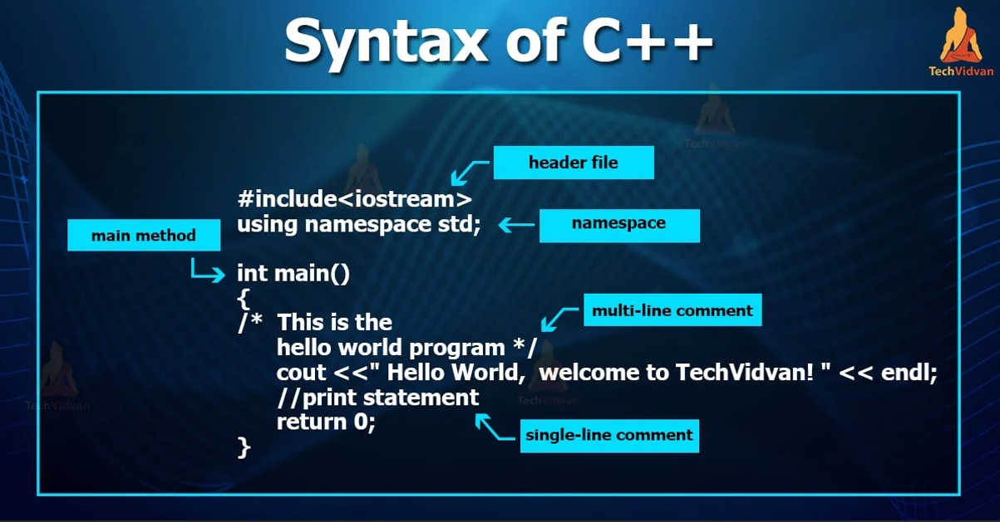

<h1>C++ 42 Modules</h1>
<!--  -->

Welcome to the 42 C++ Modules! This is a set of learning modules created to help you master the C++ programming language. Each module is designed to focus on specific concepts and gradually guide you through various fundamental and advanced topics in C++.

<h2>Modules Overview</h2>

The 42 C++ curriculum is divided into various modules that progressively introduce key concepts and coding challenges. The curriculum is structured to help students gain a comprehensive understanding of C++ and its intricacies.

<h2>Modules List</h2>

Here is a breakdown of the modules included in the 42 C++ program:

<ol>
    <li><strong>Module 01: Introduction to C++</strong>
        
This module introduces you to the basic syntax and structure of a C++ program. You will learn about variables, functions, and basic I/O operations.

    </li>
    <li><strong>Module 02: Control Flow</strong>
        
Learn about control flow structures like conditionals (if, else), loops (for, while), and switch statements. You'll also understand how to handle errors and exceptions.

    </li>
    <li><strong>Module 03: Functions and Recursion</strong>
        
Get comfortable with creating and calling functions, understanding scope, and practicing recursion for problem-solving.

    </li>
    <li><strong>Module 04: Object-Oriented Programming (OOP)</strong>
        
This is a core module where you will dive into the fundamentals of OOP, including classes, objects, inheritance, polymorphism, and encapsulation.

    </li>
    <li><strong>Module 05: Memory Management</strong>
        
Learn about pointers, dynamic memory allocation (new, delete), and memory management techniques that are crucial in C++ programming.

    </li>
    <li><strong>Module 06: Data Structures</strong>
        
This module introduces essential data structures like arrays, linked lists, stacks, queues, and hash tables.

    </li>
    <li><strong>Module 07: Algorithms</strong>
        
Explore fundamental algorithms such as searching, sorting, and complexity analysis. You'll also implement classic algorithms like quicksort and merge sort.

    </li>
    <li><strong>Module 08: Advanced Object-Oriented Programming</strong>
        
This module covers more advanced OOP concepts like virtual functions, operator overloading, templates, and exception handling.

    </li>
    <li><strong>Module 09: STL (Standard Template Library)</strong>
        
Get to know the power of the STL in C++ for containers, iterators, algorithms, and function objects. You'll learn to leverage built-in data structures like vectors, maps, and sets.

    </li>
    <li><strong>Module 10: File Handling</strong>
        
Learn how to read and write data to files, process files efficiently, and manipulate file pointers using the fstream library.

    </li>
    <li><strong>Module 11: Multi-threading and Concurrency</strong>
        
This module introduces you to concurrency in C++ where you'll learn how to handle multi-threading using threads, mutexes, and condition variables.

    </li>
    <li><strong>Module 12: Networking and Sockets</strong>
        
Learn how to implement basic network communication using sockets. This module introduces concepts like client-server architecture and socket programming.

    </li>
</ol>

<h2>Learning Approach</h2>

The 42 C++ program follows a hands-on approach, where students are encouraged to write code, solve challenges, and apply their knowledge. The exercises in each module are designed to test both understanding and problem-solving skills.

<h2>Project-Based Learning</h2>

At the end of each major module, you'll complete a project where you apply the concepts you've learned. These projects allow you to build real-world applications and get feedback from mentors and peers.

<h2>Resources</h2>

While working on the modules, you have access to various resources:

<ul>
    <li>Official 42 C++ Documentation</li>
    <li>Online C++ references and tutorials</li>
    <li>Interactive coding platforms (e.g., <a href="https://www.cplusplus.com/" target="_blank">cplusplus.com</a>)</li>
</ul>

<h2>Conclusion</h2>

The 42 C++ modules are a challenging and rewarding learning journey. By completing the modules, you will gain a deep understanding of C++ and the skills needed to build professional applications.

<footer>
    
For more information, visit the <a href="https://www.42.fr/en/home" target="_blank">42 Network</a> official website.

</footer>